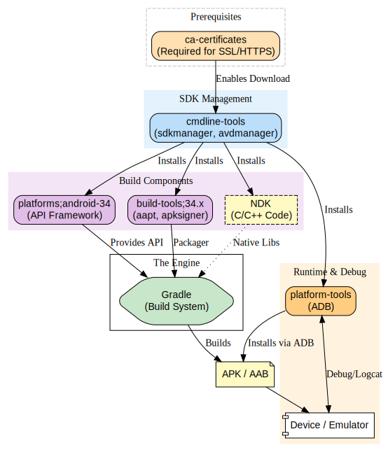

# Android / Flutter Toolchain Flow



## 1. The Foundation (Prerequisites)

**Start Point:**  
Everything begins with **ca-certificates**.  
Without these certificates, your machine cannot make secure HTTPS connections to Google’s servers.

**Result:**  
Once SSL works, the **cmdline-tools** (specifically `sdkmanager`) can connect to download the Android SDK components.

***SSL***  
Secure Sockets Layer — encrypts HTTPS traffic so downloads/authentication are secure.

***sdkmanager***  
CLI tool inside Android cmdline-tools used to download, update, and manage Android SDK components.

---

## 2. The Toolkit (Managed by cmdline-tools)

The **cmdline-tools** act as the “parent” that installs the core SDK building blocks:

- **platforms;android-34**  
  The Android API definitions needed to compile your app.

- **build-tools**  
  Contains `aapt`, `apksigner`, `zipalign` — the packagers and signers of Android apps.

- **platform-tools**  
  Contains `adb` — used to communicate with real devices or emulators.

- **NDK (optional)**  
  Only required if your Flutter or plugin code uses native C/C++.

***Toolkit***  
A collection of tools that work together to build, package, and deploy Android apps.

***SDK building block***  
Individual components of the Android SDK required for compiling, packaging, signing, and deploying apps.

***aapt***  
Android Asset Packaging Tool — packages app resources into APKs.

***apksigner***  
Signs APKs so Android devices trust and install them.

***zipalign***  
Optimizes APK file alignment for faster loading and smaller size.

***adb***  
Android Debug Bridge — installs apps, logs, debugs, communicates with real devices/emulators.

***NDK***  
Native Development Kit — lets apps include C/C++ code for performance-critical parts.

***APK***  
Android Package — installable app file for Android devices.

***AAB***  
Android App Bundle — Play Store distribution format; Google splits it into device-optimized APKs.

---

## 3. The Factory (Gradle)

When you run:

```
flutter build apk
```

**Gradle** becomes the orchestrator:

- Reads **Platforms** to understand Android API rules  
- Uses **Build-Tools** to compile, package, and sign  
- Produces the final **APK** or **AAB**

**Output:** A finished Android application package.

---

## 4. The Deployment (Platform-Tools)

Once the APK exists:

- **adb** (inside platform-tools) pushes it to your phone  
- Reads logs, handles installs, debug output, etc.

***adb***  s
The tool that pushes/install APKs, runs the app, gathers logs, and communicates with Android devices.

---

## 5. The Optional Visual Layer (Android Studio)

Everything above works fully in CLI mode.

If you install **Android Studio**, it acts as a graphical wrapper around the same tools.

But Android Studio needs:

- **X11** or **Wayland** on Linux to display windows  

If you're on a headless server or Docker container with no GUI → skip Android Studio entirely.

---

## Summary Diagram

See the diagram above for the full flow.  

---

## Mobile app landscape (Device vs. Web) 

**1. Device-Based (Native Apps):**  
- What they are:  
Apps installed via an App Store (Google Play, Apple App Store).  
- Where they live:  
On your phone’s internal storage.  
- Logic:   
They use the phone's processor directly and can access hardware like the camera, Bluetooth, and Gyroscope easily.  
- Example:   
Call of Duty Mobile, Calculator, Camera App.  

**2. Web-Based (Mobile Web Apps):**   
- What they are:   
Websites formatted to look like apps. You access them via a browser (Chrome, Safari).  
- Where they live:   
On a web server. Nothing is installed on your phone.  
- Logic:   
They run inside the browser environment.  
- Example:   
Amazon.com (in Chrome), Gmail (in Safari).  

**3. The Hybrid (Cross-Platform/PWA):**  

This is where Flutter (which you asked about earlier) fits. It allows you to write code once and deploy it as a "Device-based" app, even though the coding style feels similar to web development.   

---

##  Mobile Apps as “Web Apps” (Server-Side vs. Client-Side)  

When we talk about Mobile Web Apps, the biggest architectural decision is: "Who builds the page that the user sees?"  

Does the Server build the interface (HTML), or does the Client (the phone's browser) build it?  

**1. Server-Side Rendering (SSR)** – The "Traditional" Way  

In this model, the "brain" is the server. The mobile phone is just a display screen (a "dumb terminal").  

- The Workflow:  
1. User taps a button on their phone.
2. Request is sent to the Server.
3. Server talks to the database, performs calculations, and generates a complete HTML page.
4. Server sends the finished page back to the phone.
5. Phone browser discards the current page and loads the new one (often causing a white "flash").

- Analogy:  
You are at a restaurant. You order a burger. The kitchen (Server) assembles the bun, meat, and lettuce, puts it on a plate, and brings the finished product to your table.

- Pros:  
Good for SEO (Search Engines); the phone doesn't need a powerful processor.

- Cons:  
Feels "slow" because every tap requires a full round-trip to the internet.    

---

**Client-Side Rendering (CSR)** – The "Modern" Way (SPAs)  

In this model, the "brain" is shared. The server provides the data, but the phone builds the interface. This is how modern web apps (Single Page Applications) work.  

- The Workflow:  
1. User opens the app.  
2. Server sends a "Shell" (empty HTML structure) and a large bundle of JavaScript code.  
3. Phone (Client) executes the JavaScript to "draw" the buttons and forms.  
4. User taps a button.  
5. Phone asks the Server only for raw data (JSON), not a full page.  
6. Phone receives the data and updates only that specific part of the screen instantly.  

- Analogy:  
You order a burger. The kitchen sends you a box of ingredients (Data) and an instruction manual (JavaScript). You (Client) assemble the burger at your table.  

- Pros:  
Feels like a Native app (smooth, no page reloads, fast transitions).  

- Cons:  The initial load takes longer (downloading the script); requires a better phone processor.     

---

**Where does Flutter fit?** 

Since you are looking at Flutter: Flutter acts like Client-Side Rendering.  

When you install a Flutter app, you are installing the "rendering engine" (the Client logic) onto the device. When the app runs, it might ask a server for data, but your device is responsible for drawing every pixel on the screen. This is why it is fast and smooth.       

---
